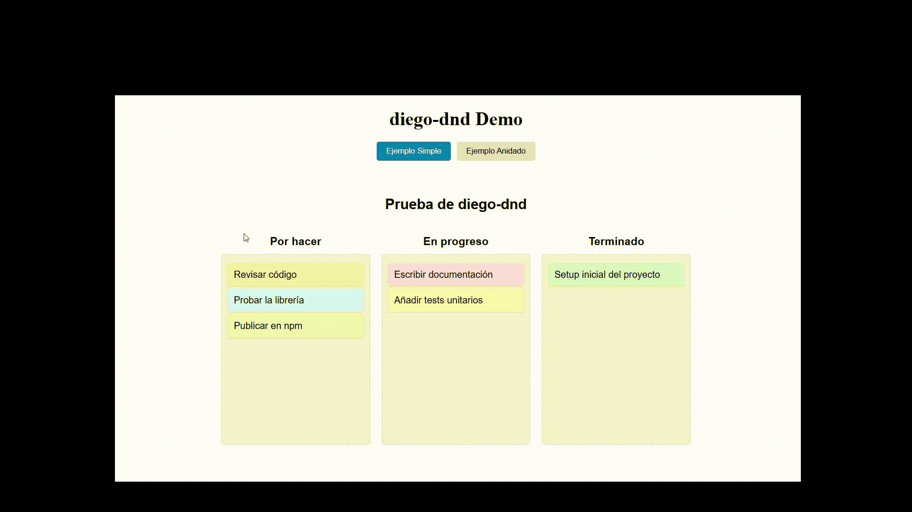
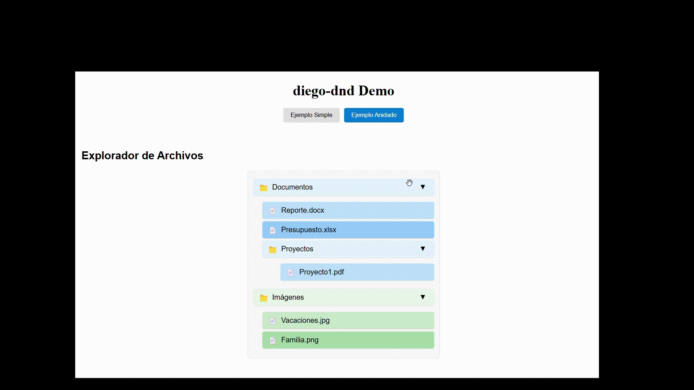

# diego-dnd


Una biblioteca de arrastrar y soltar (drag and drop) moderna para React, con soporte para estructuras anidadas, escrita en TypeScript.

<p align="center">
  
</p>
<p align="center">
  
</p>

## Características

- 🌲 **Soporte para estructuras anidadas**: Arrastra y suelta elementos en estructuras de árbol profundas
- 🎯 **Indicadores visuales**: Resalta claramente las zonas de destino y las posiciones durante el arrastre
- 🧩 **API sencilla**: Componentes con nombres intuitivos y hooks fáciles de usar
- 📦 **Ligera**: Solo ~21kB (gzipped), sin dependencias externas
- 🔍 **Modo debug**: Facilita la resolución de problemas con logs detallados
- 🔒 **Escrita en TypeScript**: Tipos completos para una experiencia de desarrollo superior

## Instalación

```bash
# Con npm
npm install diego-dnd

# Con yarn
yarn add diego-dnd

# Con pnpm
pnpm add diego-dnd
```

## Uso básico

```jsx
import React, { useState } from 'react';
import { DndProvider, Draggable, Droppable } from 'diego-dnd';
import 'diego-dnd/dist/diego-dnd.css';

const BasicExample = () => {
  const [items, setItems] = useState(['Item 1', 'Item 2', 'Item 3']);

  const handleDrop = (result) => {
    // Actualizar el estado basado en el resultado del drop
    console.log(result);
  };

  return (
    <DndProvider onDragEnd={handleDrop}>
      <div className="container">
        <Droppable id="list" type="LIST">
          {items.map((item, index) => (
            <Draggable 
              key={index} 
              id={`item-${index}`} 
              type="ITEM" 
              index={index}
            >
              <div className="item">{item}</div>
            </Draggable>
          ))}
        </Droppable>
      </div>
    </DndProvider>
  );
};
```

## Ejemplos

### Kanban Board

```jsx
import React, { useState } from 'react';
import { DndProvider, Draggable, Droppable } from 'diego-dnd';

const KanbanExample = () => {
  const [columns, setColumns] = useState({
    todo: [{ id: 'task1', content: 'Tarea 1' }],
    inProgress: [{ id: 'task2', content: 'Tarea 2' }],
    done: [{ id: 'task3', content: 'Tarea 3' }]
  });

  const handleDrop = (result) => {
    // Lógica para mover tareas entre columnas
    // Ver ejemplo completo en la documentación
  };

  return (
    <DndProvider onDragEnd={handleDrop}>
      <div style={{ display: 'flex' }}>
        {Object.keys(columns).map(columnId => (
          <Droppable key={columnId} id={columnId} type="COLUMN">
            <div className="column">
              <h2>{columnId}</h2>
              {columns[columnId].map((task, index) => (
                <Draggable
                  key={task.id}
                  id={task.id}
                  type="TASK"
                  index={index}
                  data={task}
                >
                  <div className="task">{task.content}</div>
                </Draggable>
              ))}
            </div>
          </Droppable>
        ))}
      </div>
    </DndProvider>
  );
};
```

### Explorador de archivos (estructura anidada)

Consulta [la documentación completa](docs/nested-example.md) para ver un ejemplo de estructura anidada.

## Documentación

- [Guía de inicio rápido](docs/quick-start.md)
- [API Reference](docs/api-reference.md)
- [Ejemplos avanzados](docs/examples.md)
- [FAQ](docs/faq.md)

## Soporte para navegadores

diego-dnd es compatible con todos los navegadores modernos:

- Chrome
- Firefox
- Safari
- Edge

## Licencia

MIT © [Diego Andrés Salas](https://github.com/DiegoAndres717)